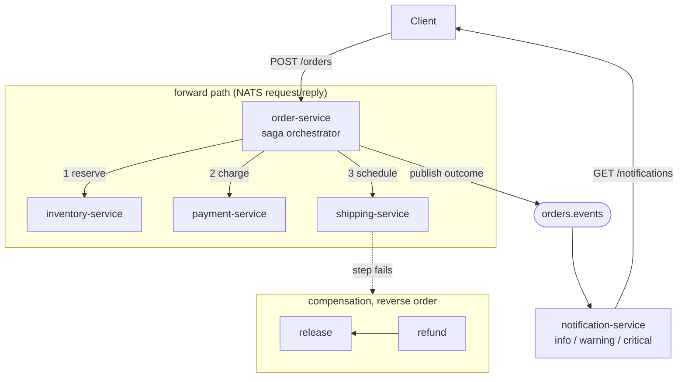

# Event-Driven Order Orchestration (Saga Pattern)

A distributed transaction across four services with no two-phase commit: an order reserves stock, takes payment, and books a shipment, and when any step fails the completed ones are undone in reverse. Built to prove I understand what actually goes wrong with sagas, not just that I can draw the happy path.

## The problem

An order touches inventory, payment and shipping, each with its own database. There is no transaction that spans all three. If payment succeeds and shipping then fails, the money is already gone and nobody is going to ship anything.

The textbook answer is two-phase commit, and essentially nobody uses it across services: it needs every participant to hold locks while waiting on a coordinator, and if the coordinator dies mid-commit the participants stay locked. The saga pattern trades atomicity for eventual consistency instead. Each step commits immediately, and each step has a compensating action that semantically undoes it. There is no rollback, only a forward action that reverses an earlier one: you do not un-charge a card, you refund it.

That trade has a consequence people skip past. Between the charge succeeding and the refund landing, the system is genuinely inconsistent and a customer really has been charged for an order that will not ship. The saga's promise is that it converges, not that the window never exists.

## What I built

Five services and a broker:

| Service | Language | Role |
|---|---|---|
| `order-service` | Go | Saga orchestrator, HTTP entry point |
| `inventory-service` | Go | `reserve` / `release` |
| `payment-service` | Go | `charge` / `refund` |
| `shipping-service` | Go | `schedule` / `cancel` |
| `notification-service` | TypeScript | Consumes outcome events, BFF read API |
| NATS | | Request/reply for commands, pub/sub for events |

The orchestration logic (`internal/saga`) knows nothing about NATS. It talks to an `Invoker` interface, so every rollback rule is unit tested in memory and the broker is an implementation detail rather than a prerequisite for knowing the logic is right.

## The three outcomes, not two

Most descriptions of this pattern have two endings: it worked, or it was compensated. This implementation has three, and the third one is the point.

```
completed    every step succeeded
compensated  a step failed, every prior step was successfully undone.
             The business transaction did not happen and the system is
             consistent. This is a correct outcome, not an error.
stuck        a step failed AND at least one compensation also failed.
             Some effects were applied and could not be undone.
```

`stuck` exists because compensation is not guaranteed to work. The payment provider can be down at exactly the moment you need to refund, which is not a hypothetical: the thing that just broke your forward path is frequently the same thing that breaks your rollback. A saga implementation that reports that case as a clean rollback is lying about the state of the system, and it is the one case that genuinely needs a human. So it gets its own status, its own HTTP code (500, where a clean rollback is 409), and its own notification severity (`critical`, where a clean rollback is `warning`).

The notification service's job is largely to preserve that distinction: a rolled-back order tells the customer "you have not been charged", and a stuck order deliberately does not say that, because it would not be true.

## Details that took the most thought

**Compensation does not inherit the caller's context.** The forward path often fails precisely *because* the caller's context timed out or the client hung up. If the rollback inherited that cancelled context, every compensation would fail instantly and the saga would strand itself half-applied, which is the exact failure the pattern exists to prevent. `context.WithoutCancel` plus a fresh deadline fixes it, and `TestCompensationRunsEvenWhenTheCallerContextIsAlreadyCancelled` pins the behaviour.

**One failed compensation does not stop the others.** If the refund fails, inventory still gets released. Undoing two of three effects is strictly better than abandoning the rollback, so the loop records the failure and keeps going.

**Participants deduplicate, and it needed a real lock.** NATS request/reply is at-least-once, so a participant will eventually see the same command twice, and a duplicate `refund` means refunding twice. My first implementation checked a "have I seen this?" map, released the mutex, then ran the handler, which leaves a window where concurrent redeliveries both find the key absent and both charge the card. `TestConcurrentDuplicatesApplyOnce` caught it with 20 goroutines, and the fix is a per-key `sync.Once` so the first caller runs the handler while the rest block and read its reply.

**Refusals are memoized, not just successes.** A participant that answered "out of stock" must give the same answer on redelivery. Letting a concurrent stock change flip that answer after the orchestrator already compensated would corrupt the saga's view of what happened.

## Orchestration or choreography

Both are sagas. The difference is where the workflow lives.

**Choreography** has no coordinator. Each service reacts to the previous service's event: inventory hears `OrderPlaced` and emits `StockReserved`, payment hears that and emits `PaymentTaken`, and so on. It is more decoupled, there is no single point of failure, and adding a consumer needs no change to anyone else.

**Orchestration**, which this project uses, has one component that holds the sequence and tells each participant what to do.

I picked orchestration for the reason that shows up in `cmd/order-service/main.go`: the entire workflow, forward steps and compensations, is a readable list in one file. Under choreography that same workflow exists only as an emergent consequence of who subscribes to what, and no single file describes it. When an order gets stuck halfway, "what was supposed to happen next?" is a question you answer by reading one list rather than by tracing event subscriptions across four repositories. Compensation ordering makes this worse for choreography: unwinding in reverse requires each service to know what came before it, which is exactly the coupling choreography was supposed to remove.

The honest cost: `order-service` knows about all three participants and is a single point of failure for starting new sagas, and every new step means editing it. For a workflow this shape, with a fixed sequence that must unwind in a defined order, I think that is the right trade. For something like "email marketing when a user signs up", where consumers are independent and order does not matter, choreography is clearly better.

**NATS rather than Kafka.** This workload needs request/reply, because the orchestrator cannot decide the next step without knowing whether the last one succeeded, and NATS core has that as a first-class primitive. Kafka is a log, and doing request/reply over it means a reply topic plus correlation IDs plus consumer groups, which is a lot of machinery for a call-and-response. Kafka's real strength is durable, replayable, partitioned history, and none of this design needs replay. The tradeoff is real and worth stating: NATS core is at-most-once on the wire with no persistence, so if the orchestrator dies mid-saga the in-flight state is gone. See limitations.

## Architecture



## Endpoints

| Method | Path | Service | Behavior |
|---|---|---|---|
| `POST` | `/orders` | order | Runs the saga. 201 completed, 409 compensated, 500 stuck |
| `GET` | `/orders/{id}` | order | The saga result |
| `GET` | `/notifications` | notification | Every outcome seen |
| `GET` | `/notifications/{orderId}` | notification | Outcomes for one order |

An order body supports two test hooks, `failAt` and `failCompensationAt`, naming a step that should refuse. They are compiled in on purpose: a saga demo is worthless unless the failures it exists to handle can be forced precisely, and killing containers mid-transaction is both slower and less exact.

## Running it

```bash
make up         # docker compose up -d --build
make simulate   # runs the seven scenarios against the running stack
make down
```

`make simulate` asserts on every outcome and exits non-zero on any mismatch:

1. Happy path completes all three steps.
2. Failure on the first step compensates nothing (compensating a step that never ran is its own bug).
3. Failure mid-saga releases the reserved stock.
4. Failure on the last step undoes payment then inventory, and asserts that order.
5. A failed compensation reports `stuck`, and inventory is still released.
6. **Conservation**: `GADGET` stock is 5. An order for all 5 that fails at shipping is rolled back, then a second order for all 5 succeeds, which is only possible if the stock genuinely came back, and a third is correctly refused. This checks the effect, not the report.
7. The notification service received all of it with the right severities.

## Testing

`go test ./...` runs 14 unit tests with no broker and no Docker:

- **`internal/saga`** (8 tests): happy path, failure at first/middle/last step, reverse compensation order asserted explicitly, a failed compensation producing `stuck` while the remaining compensations still run, steps with no compensation being skipped, and compensation surviving a cancelled caller context.
- **`internal/participant`** (6 tests): duplicate command applied once, duplicate refund not applied twice, different sagas independent, refusals stable across redelivery, unknown actions refused without being memoized, and 20 concurrent duplicates applying exactly once.

`cd notification-service && npm test` runs 7 Vitest tests over the severity mapping and the bounded store, including that a stuck order is never told "you have not been charged".

## CI

- `go-test`: `go build`, `go vet`, `go test -race`.
- `node-test`: `npm ci`, build, `npm run typecheck`, `npm test`. Typecheck is separate because Vitest strips types rather than checking them.
- `e2e`: brings up the real compose stack and runs `scripts/simulate.sh` against it.

## Known limitations (things I'd change for a real production system)

- **Saga state is in memory in the orchestrator.** If `order-service` restarts mid-saga, the in-flight saga is lost: steps already applied are never compensated. A real implementation persists a saga log before each step and recovers on startup, which is the single biggest gap here and the reason NATS JetStream or a database would be a requirement rather than a nicety.
- **No retries on the forward path.** A transient transport error fails the step and triggers a full rollback, when retrying would often have succeeded. Participants deduplicate specifically so retries would be safe to add, but the retry loop itself is not implemented.
- **`stuck` sagas are reported, not resolved.** Nothing retries the failed compensation on a schedule and nothing pages anyone. In production this is a queue with backoff plus an alert, because a stuck saga is money sitting in the wrong place.
- **Participant state is in-process maps**, so restarting a service loses reservations, the ledger and the dedupe table. Losing the dedupe table is the dangerous one: a redelivery after a restart would charge twice.
- **NATS core has no persistence.** A command published while a participant is down is simply gone. JetStream would fix this and is the natural next step.
- **No authentication between services**, and no authorization on the HTTP API.
- **The compensation timeout is a fixed 15 seconds** for the whole rollback, rather than per-step budgets tuned to each participant.
